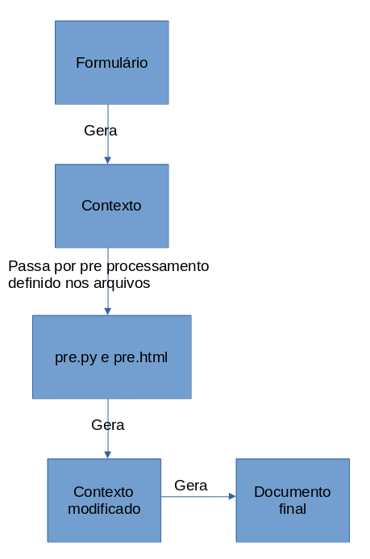

# Fastdoc

Fastdoc é um progama cujo objetivo é facilitar a redação de documentos tais como laudos. Ao executar o programa o usuário escolhe o tipo de documento o qual ele quer criar, preenche um formulário e clica no botão "Gerar docx" e o programa gerará automaticamente um documento no formato docx já com os dados preenchidos o qual pode ser utilizado para impressão direta ou modificações posteriores utilizando um editor de textos como Word. 

# Instalação no Windows (forma mais fácil)

Baixe o  arquivo [fastdoc 0.1.5.zip](https://www.4shared.com/zip/_gvuIdQ_ea/fastdoc__015.html?) e o descompacte em uma pasta de sua preferência.  
Para utilização execute o arquivo fastdoc_gui.exe. Crie um atalho para ele na area de trabalho caso necessário.

Hash SHA-512 do arquivo "fastdoc 0.1.5.zip": 
```
569a824391b7be86b864117ba3bbbb4d384e2a8104a45cd84e5a8ad5db716348eb5ee149137a1ea1e5665b8d71761ad9ee70990adf0857e617aaaa4d5a48c04f
```

# Instalação Manual

Requisitos:

- Ter Python 3.10 instalado
- Ter git instalado
- Ter Poetry instalado

## Clone o projeto
Abra o terminal em uma pasta na qual você irá salvar o projeto e execute o seguinte comando
```
git clone https://github.com/renatormc/fastdoc.git
```

## Instale as dependências
Abra o terminal na pasta fastdoc criada e execute os comandos a seguir na sequência

```
poetry install
poetry shell
python main.py start
```


## Como usar

Para execução rode o programa com o comando abaixo:
```
python main.py gui
```

## Como atualizar

Para atualizar ara o terminal na pasta do projeto e digite o seguinte comando.
```
git pull origin master
poetry install
```

# Gerenciamento de modelos

Os modelos ficam dentro da pasta "models" na raiz do projeto. Cada subpasta é um modelo diferente.

## Criar novo modelo
Para se criar um novo modelo é necessário executar o comando a seguir:

```
fastdoc.bat new-model
```

## Deletar modelos
Para se deletar um modelo é preciso digitar o comando a seguir.
```
fastdoc.bat delete-model
```
*Não delete ou crie modelos deletando ou copiando manualmente as pastas. Sempre utilize os comandos acima.*

Após criação do novo modelo basicamente o que preciso fazer é editar o arquivo templates/Main.docx dentro da pasta do modelo e criar um formulário no arquivo qt_form/qt_form.py.


# Widgets

A composição do formulário, o qual o usuário irá utilizar para entrar os dados que serão utilizados para renderização do documento é composta por widgets. Cada widget é um campo para preenchimento. O formulário é definido no arquivo "qt_form/qt_form.py" conforme exemplo a seguir.

```python
widgets: list[list[SWidget]] = [
    [
        wt.SText("nome", required=True, label="Nome", placeholder="Digite o seu nome", stretch=1),
        wt.SSpinBox("idade", label="Idade", stretch=1, min=1, max=100),
    ],
    [
        wt.SText("profissao", required=True, label="Profissão", placeholder="Digite o sua profissão"),
        wt.SDate("data_nascimento", label="Data de nascimento"),
    ],
]
```

O formulário é definido em linhas e colunas. 

```python
widgets: list[list[SWidget]] = [
    [
        widget_linha_1_coluna_1,
        widget_linha_1_coluna_2,
    ],
    [
        widget_linha_2_coluna_1,
        widget_linha_2_coluna_2,
    ],
    [
        widget_linha_3_coluna_1,
        widget_linha_3_coluna_2,
        widget_linha_3_coluna_3,
    ]
  
]

```

Os dados preenchidos no formulário comporão um conjunto de dados denominado "contexto". Este contexto será passado para o renderizador que irá utilizar o template definido no arquivo "templates/Main.docx" para gerar o documento final.

<p>

</p>

O contexto antes de ser passado para o renderizador passa por um pre processamento que pode ser definido nos arquivos pre.py e pre.html. Tal processamento tem o objetivo de trabalhar o contexto para utilizar menos código no template docx pois arquivos no formato py e html são mais simples de manipular. Contudo, este pre processamento é opcional e, caso o desenvolvedor do modelo não se interesse em utilizar o recurso ele pode optar por não utilizar. Para isso basta deixar os arquivo pre.py e pre.html inalterados.

# Validators

O formulário mostra erros de preenchimento ao usuário para isso o desenvolvedor do modelo pode utilizar-se da criação de validators. Para se criar um validator basta criar uma função que recebe o valor gerado pelo widget, analisar este valor e caso ele não seja válido lançar uma exceção do tipo "wt.ValidationError" informando a mensagem de erro a ser exibida ao usuário. É possível passar quantos validadores forem necessários para o widget no parâmetro validators. Veja o exemplo a seguir.

```python
def validar_idade(value):
    if value < 18:
        raise wt.ValidationError("A idade não pode ser menor que 18")
    if value > 60:
        raise wt.ValidationError("A idade não pode ser maior que 60")
        

widgets: list[list[SWidget]] = [
    [ 
        wt.SSpinBox("idade", validators=[validar_idade])
    ]  
]
```

# Converter

As vezes precisamos converter o valor retornado do widget para um formato mais adequado. Para isso podemos passar uma função no parâmetro "converter" para o widget. O converter também page como um validato caso basta seja lançada uma exceção do tipo "wt.ValidationError" caso haja algum erro da mesma forma que nos validators. Veja o exemplo a seguir.

```python
def converter_pericia(value):
    try:
        parts = value.split("/")
        return {
            'seq': int(parts[0]),
            'rg': int(parts[1]),
            'ano': int(parts[2])
        }
    except:
        raise wt.ValidationError("Valor incorreto")
          

widgets: list[list[SWidget]] = [
    [ 
        wt.SText("pericia", label="Perícia", converter=converter_pericia)
    ]  
]
```

No exemplo acima foi criado um wiget do tipo SText o qual por padrão retorna uma string porém foi utilizado um converter para converter a string no formato sequencial/rg/ano digitados separados por barra para um dicionário com os valores do tipo inteiro. Caso o usuário digite algo fora do padrão haverá um erro e o formulário não será validado.

# Template

No template o desenvolvedor do modelo deve definir o texto que irá ser gerado a partir das variáveis do contexto utilizando a linguagem [jinja2](https://devhints.io/jinja). 

## Variáveis

Para imprimir uma variável se deve colocar o nome da variável entre chaves duplas como:
```jinja
Olá {{ nome }} sua idade é {{ idade }}.
```
## Condicionais

É possível o uso de condicionais da seguinte forma

```jinja

O valor da variável é 1 

O valor da variável é 2

O valor da variável é diferente de 1 e 2

```
## Iterações

É possível realizar iterações utilizando a palavra "for" da seguinte forma:

```jinja

 Nome: {{ nome }}

```
A linguagem jinja2 é a lingaugem a ser utilizado tanto dentro dos templates docx como no arquivo pre.html.

## Filtros

Filtro é um função que converte um valor para outro. Por exemplo, as vezes temos um valor do tipo datetime que representa uma data qualquer porém queremos imprimir no documento a data escrita por extenso. Para isso podemos usar da seguinte forma:
```jinja
{{ data_pericia|data_completa }}
```

Assim se a variável contiver a data 12/12/2021 o filtro "data_completa" fará ser impresso a frase *"12 dias dop mês de dezembro do ano de 2021"*
O sistema já traz alguns filtros padrão que estarão disponíveis para todos os templates. Porém é possível a criação de filtros customizados por modelo. Para isto o desenvolvedor pode editar o arquivo "filters/__init__.py" existente dentor da pasta do modelo.

## Funções

Assim como os filtros também existem as funções. A diferença entre função e filtro é apenas a forma de chamada. No caso dos filtros o uso é feito utilizando o caracter "|" enquanto as funções são feitas de forma convencional utilizando parêntestes

Exemplo de uso de filtro
```jinja
{{ data_pericia|data_completa }}
```

Exemplo de uso de uma função
```jinja
{{ converter_data(data_pericia) }}
```

A vantagem do uso de filtros em vez de funções é a possiblidade de aninhar vários filtros apenas seprando eles por "|":
```jinja
{{ variavel|filtro1|filtro2|filtro3 }}
```

Se fosse fazer o mesmo com funções seria da seguinte forma:

```jinja
{{ funcao1(funcao2(funcao3(variavel))) }}
```
Como se pode ver o encadeamento de funções é menos agradável aos olhos do que o encadeamento de filtros.

Assim como os filtros existem funções gerais que estarão disponíveis para todos os modelos com a possibilidade de o desenvolvedor do modelo definir funções customizadas por modelo. Para isso basta editar o arquivo "functions/__init__.py"


## Inserção de imagens

Para se inserir imagens no documento foi disponilizada a função "image" que deve ser utilizada passando-se como primeiro parâmetro o endereço do arquivo de imagem e como segundo parâmetro a largura em mílimetros.

```jinja
{{ image('/caminho/da/imagem/imagem.png', 80) }}
```
